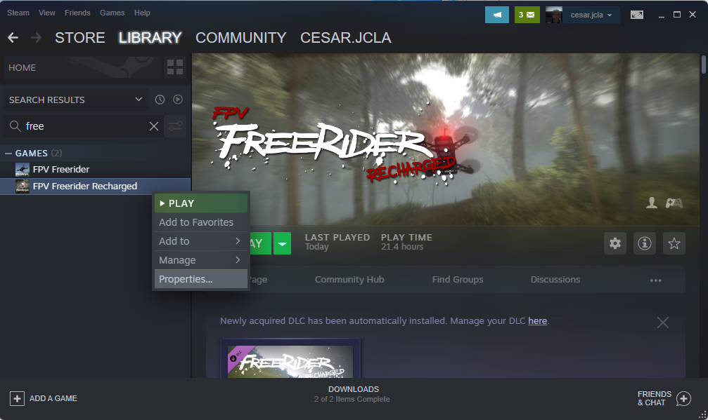
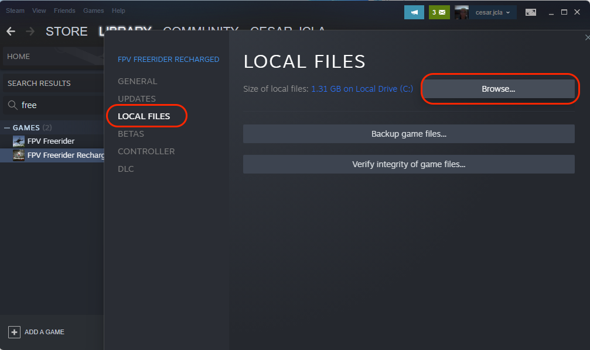
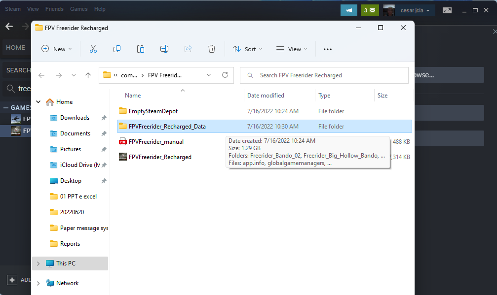
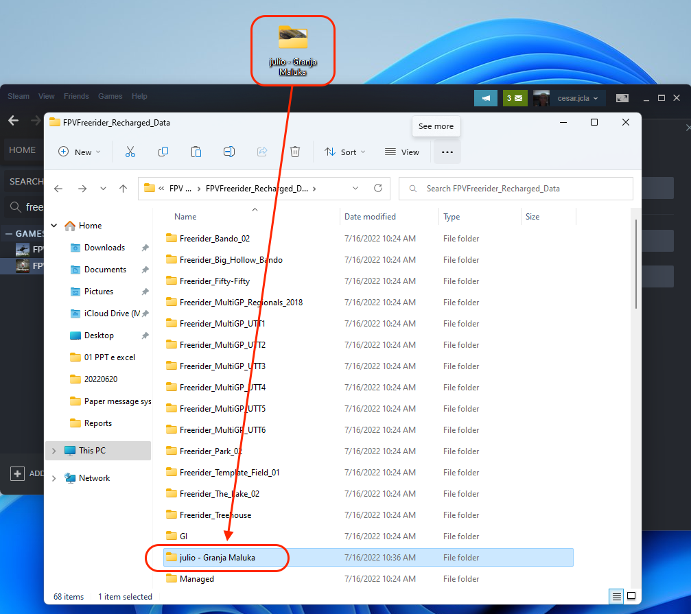
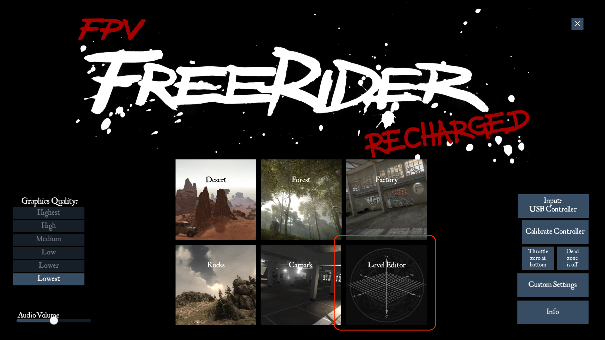
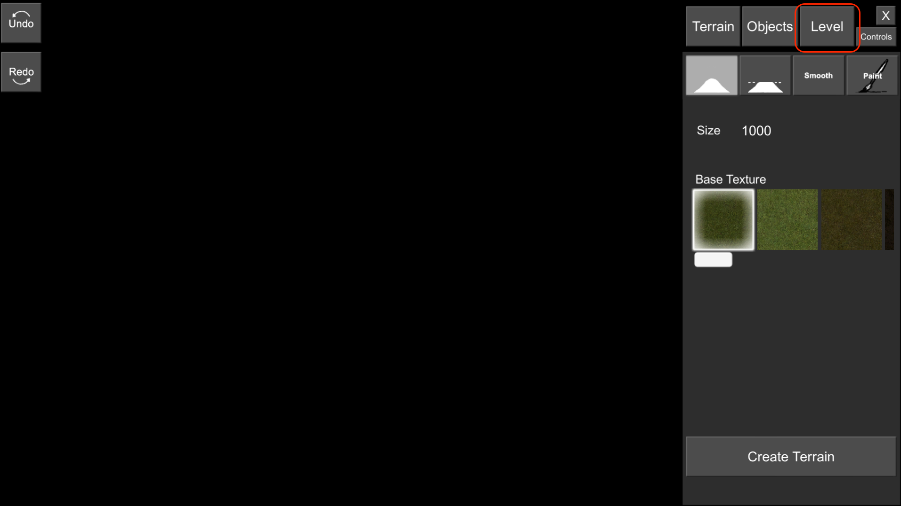
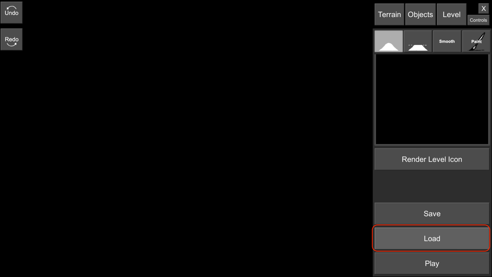
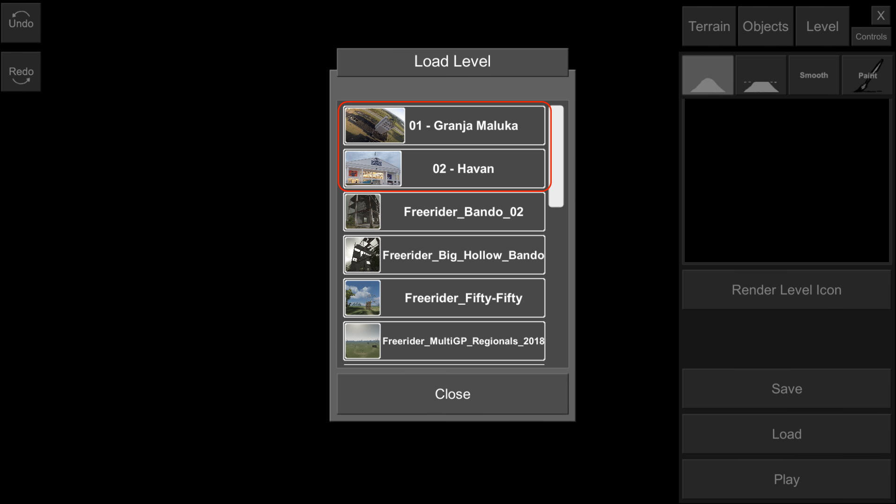
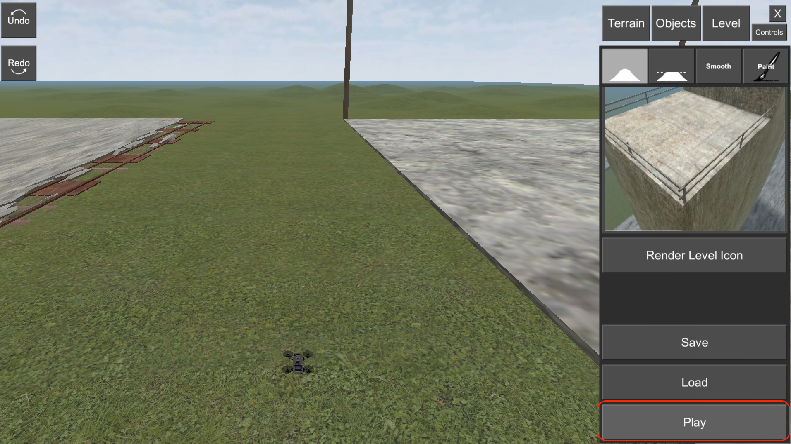
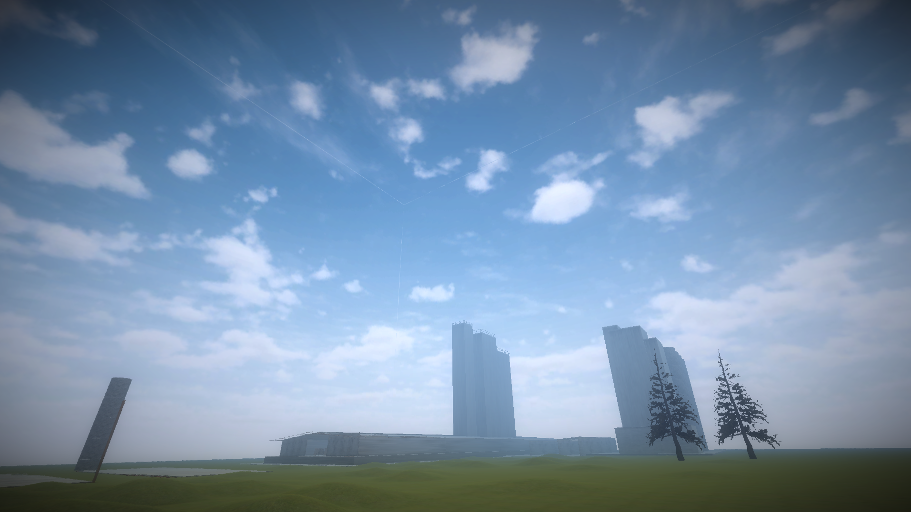

Mapa: Havan Jacareí           |  .
:-------------------------:|:-------------------------:
  |  

# Tutorial de instalação das pistas do FPV FreeRider Recharged

Esse tutorial serve para ajudar na instalação de novas pistas baixadas da internet no simulador FPV FreeRider Recharged (não é possível na versão antiga do FreeRider).

# Preparação:

1. É necessário ter o simulador FreeRider Recharged instalado
2. Faça o download das pistas [AQUI](https://github.com/julio-cesar-leitao/freerider/tree/main/Pistas).

# Instalação:

Para instalar as pistas basta depositá-las no diretório correto, abaixo será mostrado passo a passo com o S.O. Windows:

## 1)

## 2)

## 3)

## 4)

## 5)

## 6)

## 7)

## 8)

## 9)

## 10)

# Usando as pistas
Após instaladas, basta seguir a partir do item 5 de "Instalação" para iniciar o mapa.

# Manutenção
Caso façam um mapa novo ou modificação nos disponíveis aqui podem entrar em contato com cesar.jcla@gmail.com para eu adicionar no repositório.

## License
[MIT](https://choosealicense.com/licenses/mit/)
